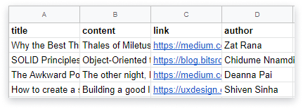
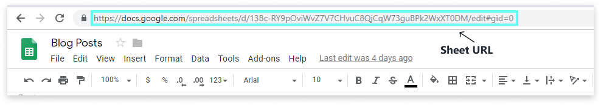

Start by creating an API.

## Prepare your sheet

Populate the first row of your sheet with the columns names. Think of these as the field names of your sheet-powered database. There are no restrictions on what you can name them.

The following rows should contain the corresponding data.

Here's an [example sheet](https://docs.google.com/spreadsheets/d/13Bc-RY9pOviWvZ7V7CHvuC8QjCqW73guBPk2WxXT0DM/edit#gid=0) with a list of blog post summaries.



## Copy your sheet's URL

Find your spreadsheet's URL in your browser's address bar.



```text
Example sheet URL:
https://docs.google.com/spreadsheets/d/13Bc-RY9pOviWvZ7V7CHvuC8QjCqW73guBPk2WxXT0DM/edit?ouid=106603351395721144148&usp=sheets_home&ths=true
```

## Create an API
Start by signing up for [Stein](https://steinhq.com).

After you sign up, you'll be prompted for your sheet's URL. The sheet will be used for creating your first API. Paste the URL to get started with Stein.

The interface will then provide you the URL for your spreadsheet's API, in the format `https://api.steinhq.com/v1/storages/[your-api-id]`. This URL is common for all the sheets in your spreadsheet.

:::note Remember to append your sheet's name to access your API
You need to append the name of the specific sheet you want to access through the Stein API. If you want to access _Sheet1_ from your spreadsheet, your API URL will now be `https://api.steinhq.com/v1/storages/[your-api-id]/Sheet1`
:::

You can later create more APIs from your dashboard.
